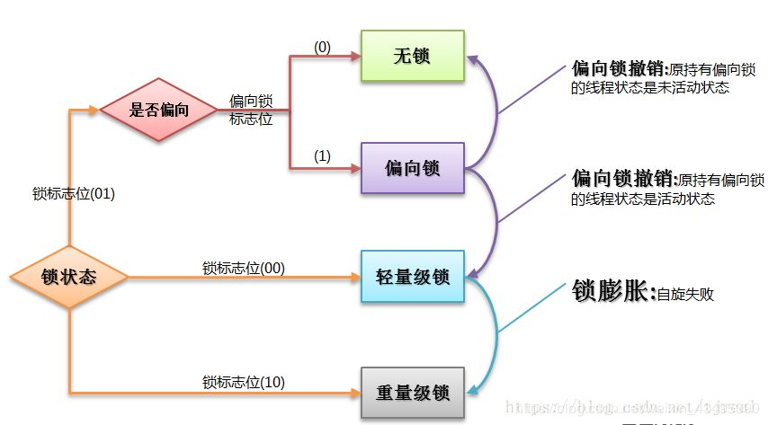

## 多线程

### 1. 多线程的几种实现方式，什么是线程安全。

> 实现 **Runable** 接口，继承 **Thread** `[θred]` 类。
>
> [JAVA多线程和并发基础面试问答](http://ifeve.com/java-multi-threading-concurrency-interview-questions-with-answers/)

### 2. Volatile 的原理，作用，能代替锁么。

> **Volatile** 利用内存栅栏机制来保持变量的一致性。不能代替锁，其只具备数据可见性一致性，不具备原子性。
>
> [Volatile 变量](https://blog.csdn.net/gongzi2311/article/details/20715185)

### 3. 画一个线程的生命周期状态图。

> 线程的 5 种基本状态（或称有7种状态），其中阻塞有三种（）：
>
> * 新建（New）：在生成线程对象，并没有调用该对象的start方法，这是线程处于创建状态。
> * 就绪（Runnable）：当调用了线程对象的start方法之后，该线程就进入了就绪状态，但是此时线程调度程序还没有把该线程设置为当前线程，此时处于就绪状态。在线程运行之后，从等待或者睡眠中回来之后，也会处于就绪状态。
> * 运行（Running）：线程调度程序将处于就绪状态的线程设置为当前线程，此时线程就进入了运行状态，开始运行run函数当中的代码。
> * 阻塞（Blocked）（等待阻塞、同步阻塞、其他阻塞）：线程正在运行的时候，被暂停，通常是为了等待某个时间的发生(比如说某项资源就绪)之后再继续运行。sleep、suspend、wait等方法都可以导致线程阻塞。
> * 死亡（Dead）：如果一个线程的run方法执行结束或者调用stop方法后，该线程就会死亡。对于已经死亡的线程，无法再使用start方法令其进入就绪。
>
> 
>
> [Java线程状态图](http://ifeve.com/thread-status/)

### 4. Sleep() 和wait()的区别。

> * Sleep是休眠线程；wait是等待。
> * Sleep是thread的静态方法；wait则是object的方法。
> * Sleep依旧持有锁，并在指定时间自动唤醒；wait则释放锁。
>
> ---
>
> * **sleep()**：方法是线程类（Thread）的静态方法，让调用线程进入睡眠状态，让出执行机会给其他线程，等到休眠时间结束后，线程进入就绪状态和其他线程一起竞争cpu的执行时间。因为sleep() 是static静态的方法，他不能改变对象的机锁，当一个synchronized块中调用了sleep() 方法，线程虽然进入休眠，但是对象的机锁没有被释放，其他线程依然无法访问这个对象。
> * **wait()**：wait() 是Object的方法，当一个线程执行到wait方法时，它就进入到一个和该对象相关的等待池，同时释放对象的机锁，使得其他线程能够访问，可以通过notify，notifyAll方法来唤醒等待的线程。
>
> [Sleep() 和wait()的区别](https://blog.csdn.net/xyh269/article/details/52613507)

### 5. notify()和 notifyAll()有什么区别？
> 如果线程调用了对象的 wait()方法，那么线程便会处于该对象的等待池中，等待池中的线程不会去竞争该对象的锁。
> 当有线程调用了对象的 notifyAll()方法（唤醒所有 wait 线程）或 notify()方法（只随机唤醒一个 wait 线程），被唤醒的的线程便会进入该对象的锁池中，锁池中的线程会去竞争该对象锁。也就是说，调用了notify后只要一个线程会由等待池进入锁池，而notifyAll会将该对象等待池内的所有线程移动到锁池中，等待锁竞争。
> 优先级高的线程竞争到对象锁的概率大，假若某线程没有竞争到该对象锁，它还会留在锁池中，唯有线程再次调用 wait()方法，它才会重新回到等待池中。而竞争到对象锁的线程则继续往下执行，直到执行完了 synchronized 代码块，它会释放掉该对象锁，这时锁池中的线程会继续竞争该对象锁。

### 6. 线程的 run()和 start()有什么区别？

> 每个线程都是通过某个特定Thread对象所对应的方法run()来完成其操作的，方法run()称为线程体。通过调用Thread类的start()方法来启动一个线程。
>
> * start()方法来启动一个线程，真正实现了多线程运行。这时无需等待run方法体代码执行完毕，可以直接继续执行下面的代码； 这时此线程是处于就绪状态， 并没有运行。 然后通过此Thread类调用方法run()来完成其运行状态， 这里方法run()称为线程体，它包含了要执行的这个线程的内容， Run方法运行结束， 此线程终止。然后CPU再调度其它线程。
> * run()方法是在本线程里的，只是线程里的一个函数,而不是多线程的。 如果直接调用run(),其实就相当于是调用了一个普通函数而已，直接待用run()方法必须等待run()方法执行完毕才能执行下面的代码，所以执行路径还是只有一条，根本就没有线程的特征，所以在多线程执行时要使用start()方法而不是run()方法。

### 7. Lock 与 Synchronized 的区别。

> * 首先两者都保持了并发场景下的原子性和可见性，区别则是synchronized的释放锁机制是交由其自身控制，且互斥性在某些场景下不符合逻辑，无法进行干预，不可人为中断等。
> * 而lock常用的则有ReentrantLock和readwritelock两者，添加了类似锁投票、定时锁等候和可中断锁等候的一些特性。此外，它还提供了在激烈争用情况下更佳的性能。
>
> [【Java线程】锁机制：synchronized、Lock、Condition](https://blog.csdn.net/vking_wang/article/details/9952063)

### 8. Synchronized 的原理是什么，解释以下名词：重排序，自旋锁，偏向锁，轻量级锁，可重入锁，公平锁，非公平锁，乐观锁，悲观锁。

> Synchronized 底层是通过监视器的enter和exit实现
>
> [Java并发编程：Synchronized及其实现原理](https://my.oschina.net/cnarthurs/blog/847801)
>
> [自旋锁、阻塞锁、可重入锁、悲观锁、乐观锁、读写锁、偏向所、轻量级锁、重量级锁、锁膨胀、对象锁和类锁](https://blog.csdn.net/a314773862/article/details/54095819)
>
> ---
>
> * 首先synchronized是java内置关键字，在jvm层面，Lock是个java类；
> * synchronized无法判断是否获取锁的状态，Lock可以判断是否获取到锁；
> * synchronized会自动释放锁(a 线程执行完同步代码会释放锁 ；b 线程执行过程中发生异常会释放锁)，Lock需在finally中手工释放锁（unlock()方法释放锁），否则容易造成线程死锁；
> * 用synchronized关键字的两个线程1和线程2，如果当前线程1获得锁，线程2线程等待。如果线程1阻塞，线程2则会一直等待下去，而Lock锁就不一定会等待下去，如果尝试获取不到锁，线程可以不用一直等待就结束了；
> * synchronized的锁可重入、不可中断、非公平，而Lock锁可重入、可判断、可公平（两者皆可）；
>   Lock锁适合大量同步的代码的同步问题，synchronized锁适合代码少量的同步问题。

### 9. 用过哪些原子类，他们的原理是什么。

> AtomicInteger、AtomicLong、AtomicReference、AtomicBoolean
>
> 基于CAS原语实现 ，比较并交换、加载链接/条件存储，最坏的情况下是旋转锁
>
> [流行的原子](https://www.ibm.com/developerworks/cn/java/j-jtp11234/index.html)
>
> [Java原子类实现原理分析](https://www.cnblogs.com/chengxiao/p/6789109.html)

### 10. 用过线程池吗，newCache 和 newFixed 有什么区别，他们的原理简单概括下，构造函数的各个参数的含义是什么，比如 coreSize，maxsize 等。

> * newSingleThreadExecutor返回以个包含单线程的Executor,将多个任务交给此Exector时，这个线程处理完一个任务后接着处理下一个任务，若该线程出现异常，将会有一个新的线程来替代。
> * newFixedThreadPool返回一个包含指定数目线程的线程池，如果任务数量多于线程数目，那么没有没有执行的任务必须等待，直到有任务完成为止。
> * newCachedThreadPool根据用户的任务数创建相应的线程来处理，该线程池不会对线程数目加以限制，完全依赖于JVM能创建线程的数量，可能引起内存不足。
> * 底层是基于ThreadPoolExecutor实现，借助reentrantlock保证并发。
> * coreSize核心线程数，maxsize最大线程数。
>
> [Java线程池架构(一)原理和源码解析](http://ifeve.com/java-threadpoolexecutor/)

### 11. 线程池的关闭方式有几种，各自的区别是什么。

> Shutdown（清空工作队列）、shutdownNow（终止线程池中各个线程）、tryTerminate（销毁线程池）
>
> [ThreadPoolExecutor(五)——线程池关闭相关操作](https://blog.csdn.net/xxcupid/article/details/51993235)

### 12. 假如有一个第三方接口，有很多个线程去调用获取数据，现在规定每秒钟最多有 10 个线程同时调用它，如何做到。

> ScheduledThreadPoolExecutor 设置定时，进行调度。
>
> ```java
> public ScheduledThreadPoolExecutor(int corePoolSize,
> ThreadFactory threadFactory) {
> 	super(corePoolSize, Integer.MAX_VALUE, 0, TimeUnit.NANOSECONDS,
> 	new DelayedWorkQueue(), threadFactory);
> }
> ```
>
> [Java线程池架构(二)多线程调度器](http://ifeve.com/java-scheduledthreadpoolexecutor/)

### 13. spring 的 controller 是单例还是多例，怎么保证并发的安全。

> 单例
> 通过单例工厂 DefaultSingletonBeanRegistry实现单例
> 通过AsyncTaskExecutor保持安全

### 14. 用三个线程按顺序循环打印 abc 三个字母，比如 abcabcabc。

> ```java
> public static void main(String[] args) {
> 	final String str = "abc";
> 	ExecutorService executorService= Executors.newFixedThreadPool(3);
> 	executorService.execute(new Runnable() {
> 		@Override
> 		public void run() {
> 			System.out.println("1" + str);
> 		}
> 	});
> 	executorService.execute(new Runnable() {
> 		@Override	
> 			public void run() {
> 			System.out.println("2" + str);
> 		}
> 	});
> 	executorService.execute(new Runnable() {
> 		@Override
> 		public void run() {
> 			System.out.println("2" + str);
> 		}
> 	});
> }
> ```

### 15. ThreadLocal 用过么，用途是什么，原理是什么，用的时候要注意什么。

> * **用途**：**Threadlocal** 底层是通过 **threadlocalMap** 进行存储键值 每个 **ThreadLocal** 类创建一个 **Map**，然后用线程的ID作为Map的key，实例对象作为Map的value，这样就能达到各个线程的值隔离的效果。
> * **原理**：**ThreadLocal** 的作用是提供线程内的局部变量，这种变量在线程的生命周期内起作用，减少同一个线程内多个函数或者组件之间一些公共变量的传递的复杂度。
> * **注意点**：谁设置谁负责移除
>
> [java ThreadLocal(应用场景及使用方式及原理)](https://blog.csdn.net/coslay/article/details/38293689)
>
> [简单理解ThreadLocal原理和适用场景，多数据源下ThreadLocal的应用](https://blog.csdn.net/qq_36632687/article/details/79551828)

### 16.  如果让你实现一个并发安全的链表，你会怎么做。

> * Collections.synchronizedList()
> * ConcurrentLinkedQueue
>
> [java多线程（十）使用线程安全的集合](https://blog.csdn.net/xingjiarong/article/details/48046751)

### 17. 有哪些无锁数据结构，他们实现的原理是什么。

> **LockFree**、**CAS**
> 基于 **JDK** 提供的原子类原语实现，例如 **AtomicReference**
>
> [java并发编程5：实现锁无关数据结构](https://blog.csdn.net/b_h_l/article/details/8704480)

### 18. 讲讲 java 同步机制的 wait() 和 notify()。

> 首先这两个方法只能在同步代码块中调用，wait会释放掉对象锁，等待notify唤醒。
>
> [Java 同步方式 (2) —— wait和notify/notifyall](https://blog.csdn.net/ithomer/article/details/7685594)

### 19. 多线程如果线程挂住了怎么办。

> 根据具体情况（sleep()、wait()、join() 等），酌情选择 notifyAll()、notify() 进行线程唤醒。
>
> [java线程技术6_线程的挂起和唤醒](http://blog.chinaunix.net/uid-122937-id-215913.html)

### 20. countdowlatch 和 cyclicbarrier 的内部原理和用法，以及相互之间的差别。

> * CountDownLatch是一个同步辅助类，在完成一组正在其他线程中执行的操作之前，它运行一个或者多个线程一直处于等待状态。
> * CyclicBarrier要做的事情是，让一组线程到达一个屏障（也可以叫同步点）时被阻塞，直到最后一个线程到达屏障时，屏障才会开门，所有被屏障拦截的线程才会继续运行。
> * CyclicBarrier初始化的时候，设置一个屏障数。线程调用await()方法的时候，这个线程就会被阻塞，当调用await()的线程数量到达屏障数的时候，主线程就会取消所有被阻塞线程的状态。
>   前者是递减，不可循环，后者是递加，可循环用
> * countdowlatch 基于abq cb基于ReentrantLock Condition
>
> [Java中的并发工具CountDownLatch、CyclicBarrier、Semapphore使用详解](https://www.jianshu.com/p/a101ae9797e3)
>
> [CyclicBarrier和CountDownLatch区别](https://blog.csdn.net/tolcf/article/details/50925145)

### 21. 使用 synchronized 修饰静态方法和非静态方法有什么区别。

> 对象锁和类锁
>
> [Synchronized相关](https://yq.aliyun.com/articles/24226)

### 22. 简述 ConcurrentLinkedQueue LinkedBlockingQueue 的用处和不同之处。

> * LinkedBlockingQueue 是一个基于单向链表的、范围任意的（其实是有界的）、FIFO 阻塞队列。
> * ConcurrentLinkedQueue是一个基于链接节点的无界线程安全队列，它采用先进先出的规则对节点进行排序，当我们添加一个元素的时候，它会添加到队列的尾部，当我们获取一个元素时，它会返回队列头部的元素。它采用了“wait－free”算法来实现，该算法在Michael & Scott算法上进行了一些修改, Michael & Scott算法的详细信息可以参见参考资料一。
>
> [聊聊并发（六）ConcurrentLinkedQueue的实现原理分析](http://ifeve.com/concurrentlinkedqueue/)
>
> [JUC LinkedBlockingQueue](http://ifeve.com/juc-linkedblockingqueue/)
>
> [并发队列ConcurrentLinkedQueue与阻塞队列LinkedBlockingQueue的区别](https://blog.csdn.net/xiaohulunb/article/details/38932923)

### 23. 导致线程死锁的原因？怎么解除线程死锁。

> 死锁问题是多线程特有的问题，它可以被认为是线程间切换消耗系统性能的一种极端情况。在死锁时，线程间相互等待资源，而又不释放自身的资源，导致无穷无尽的等待，其结果是系统任务永远无法执行完成。死锁问题是在多线程开发中应该坚决避免和杜绝的问题。
>
> 一般来说，要出现死锁问题需要满足以下条件：
>
> 1. 互斥条件：一个资源每次只能被一个线程使用。
> 2. 请求与保持条件：一个进程因请求资源而阻塞时，对已获得的资源保持不放。
> 3. 不剥夺条件：进程已获得的资源，在未使用完之前，不能强行剥夺。
> 4. 循环等待条件：若干进程之间形成一种头尾相接的循环等待资源关系。
> 5. 只要破坏死锁 4 个必要条件之一中的任何一个，死锁问题就能被解决。
>
> [Java 程序死锁问题原理及解决方案](https://www.ibm.com/developerworks/cn/java/j-lo-deadlock/)

### 24. 非常多个线程（可能是不同机器），相互之间需要等待协调，才能完成某种工作，问怎么设计这种协调方案。

> 此问题的本质是保持顺序执行。可以使用executors

### 25. 并行和并发有什么区别？

> * 并发：当有多个线程在操作时,如果系统只有一个CPU,则它根本不可能真正同时进行一个以上的线程，它只能把CPU运行时间划分成若干个时间段,再将时间 段分配给各个线程执行，在一个时间段的线程代码运行时，其它线程处于挂起状。.这种方式我们称之为并发(Concurrent)。
> * 并行：当系统有一个以上CPU时,则线程的操作有可能非并发。当一个CPU执行一个线程时，另一个CPU可以执行另一个线程，两个线程互不抢占CPU资源，可以同时进行，这种方式我们称之为并行(Parallel)。

### 26. 线程和进程的区别

> 简而言之，进程是程序运行和资源分配的基本单位，一个程序至少有一个进程，一个进程至少有一个线程。进程在执行过程中拥有独立的内存单元，而多个线程共享内存资源，减少切换次数，从而效率更高。线程是进程的一个实体，是cpu调度和分派的基本单位，是比程序更小的能独立运行的基本单位。同一进程中的多个线程之间可以并发执行。

### 27. 守护线程是什么？

> 守护线程（即daemon thread），是个服务线程，准确地来说就是服务其他的线程。

### 28. 创建线程有哪几种方式？

> 1. **继承Thread类创建线程类**
>    定义Thread类的子类，并重写该类的run方法，该run方法的方法体就代表了线程要完成的任务。因此把run()方法称为执行体。
>    创建Thread子类的实例，即创建了线程对象。
>    调用线程对象的start()方法来启动该线程。
>2. **通过Runnable接口创建线程类**
>    定义runnable接口的实现类，并重写该接口的run()方法，该run()方法的方法体同样是该线程的线程执行体。
>    创建 Runnable实现类的实例，并依此实例作为Thread的target来创建Thread对象，该Thread对象才是真正的线程对象。
>    调用线程对象的start()方法来启动该线程。
> 3. **通过Callable和Future创建线程**
>     创建Callable接口的实现类，并实现call()方法，该call()方法将作为线程执行体，并且有返回值。
>    创建Callable实现类的实例，使用FutureTask类来包装Callable对象，该FutureTask对象封装了该Callable对象的call()方法的返回值。
>    使用FutureTask对象作为Thread对象的target创建并启动新线程。
>    调用FutureTask对象的get()方法来获得子线程执行结束后的返回值。
> 

### 29. 创建线程池有哪几种方式？

> 1. **newFixedThreadPool(int nThreads)**
>    创建一个固定长度的线程池，每当提交一个任务就创建一个线程，直到达到线程池的最大数量，这时线程规模将不再变化，当线程发生未预期的错误而结束时，线程池会补充一个新的线程。
>2. **newCachedThreadPool()**
>    创建一个可缓存的线程池，如果线程池的规模超过了处理需求，将自动回收空闲线程，而当需求增加时，则可以自动添加新线程，线程池的规模不存在任何限制。
> 3. **newSingleThreadExecutor()**
>     这是一个单线程的Executor，它创建单个工作线程来执行任务，如果这个线程异常结束，会创建一个新的来替代它；它的特点是能确保依照任务在队列中的顺序来串行执行。
> 
> 4. **newScheduledThreadPool(int corePoolSize)**
>     创建了一个固定长度的线程池，而且以延迟或定时的方式来执行任务，类似于Timer。

### 30. 说一下 runnable 和 callable 有什么区别？

> * Runnable接口中的run()方法的返回值是void，它做的事情只是纯粹地去执行run()方法中的代码而已；
> * Callable接口中的call()方法是有返回值的，是一个泛型，和Future、FutureTask配合可以用来获取异步执行的结果。

### 31. 线程池都有哪些状态？

> 线程池有5种状态：Running、Shutdown、Stop、Tidying、Terminated。
>
> 线程池各个状态切换框架图：
>
> ```mermaid
> graph LR
> A[Running]
> B[Shutdown]
> C[Stop]
> D[Tidying]
> E[Terminated]
> A --shutdown&#40&#41--> B
> A --shutdownNow&#40&#41--> C
> B --队列为空&#44并且线程池中</br>执行的任务也为空--> D
> C --线程池中执行的任务为空--> D
> D --terminated&#40&#41执行完毕--> E
> ```

### 32. 线程池中 submit()和 execute()方法有什么区别？

> 接收的参数不一样
>
> * submit有返回值，而execute没有
> * submit方便Exception处理

### 33. 在 java 程序中怎么保证多线程的运行安全

> 线程安全在三个方面体现：
>
> * **原子性**：提供互斥访问，同一时刻只能有一个线程对数据进行操作，（atomic，synchronized）；
> * **可见性**：一个线程对主内存的修改可以及时地被其他线程看到，（synchronized，volatile）；
> * **有序性**：一个线程观察其他线程中的指令执行顺序，由于指令重排序，该观察结果一般杂乱无序，（happens-before原则）。

### 34. 多线程锁的升级原理是什么？

> 在Java中，锁共有4种状态，级别从低到高依次为：**无状态锁**、**偏向锁**、**轻量级锁** 和 **重量级锁 **状态，这几个状态会随着竞争情况逐渐升级。锁可以升级但不能降级。
>
> 锁升级的图示过程：
>
> 

### 35. 什么是死锁

> **死锁 **是指两个或两个以上的进程在执行过程中，由于竞争资源或者由于彼此通信而造成的一种阻塞的现象，若无外力作用，它们都将无法推进下去。此时称系统处于死锁状态或系统产生了死锁，这些永远在互相等待的进程称为死锁进程。是操作系统层面的一个错误，是进程死锁的简称，最早在 1965 年由 Dijkstra 在研究银行家算法时提出的，它是计算机操作系统乃至整个并发程序设计领域最难处理的问题之一。

### 36. ThreadLocal 是什么？有哪些使用场景？

> 线程局部变量是局限于线程内部的变量，属于线程自身所有，不在多个线程间共享。Java提供ThreadLocal类来支持线程局部变量，是一种实现线程安全的方式。但是在管理环境下（如 web 服务器）使用线程局部变量的时候要特别小心，在这种情况下，工作线程的生命周期比任何应用变量的生命周期都要长。任何线程局部变量一旦在工作完成后没有释放，Java 应用就存在内存泄露的风险。

### 37. 对ajax的理解

> Ajax为异步请求，即局部刷新技术，在传统的页面中，用户需要点击按钮或者事件触发请求，到刷新页面，而异步技术为不需要点击即可触发事件，这样使得用户体验感增强，比如商城购物车的异步加载，当你点击商品时无需请求后台而直接动态修改参数。